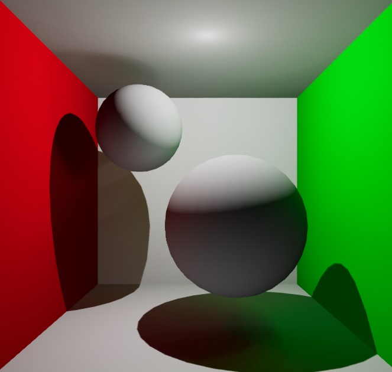
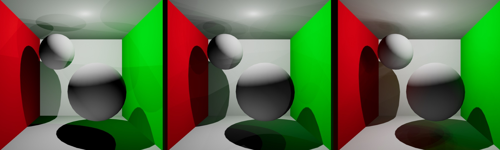
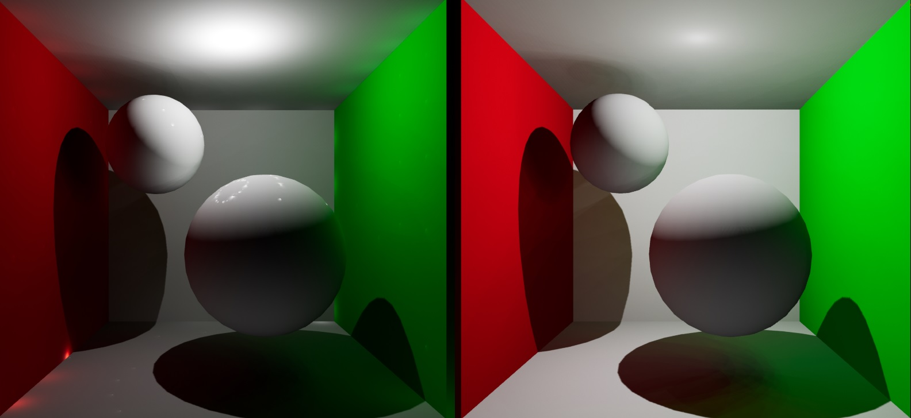
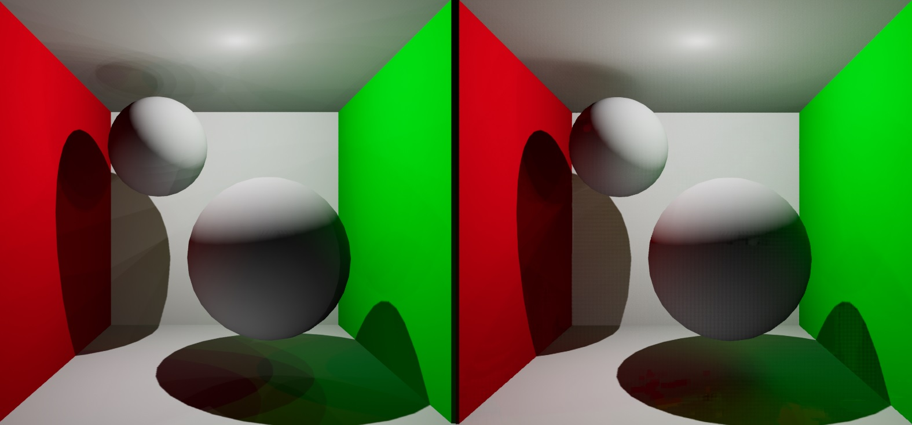
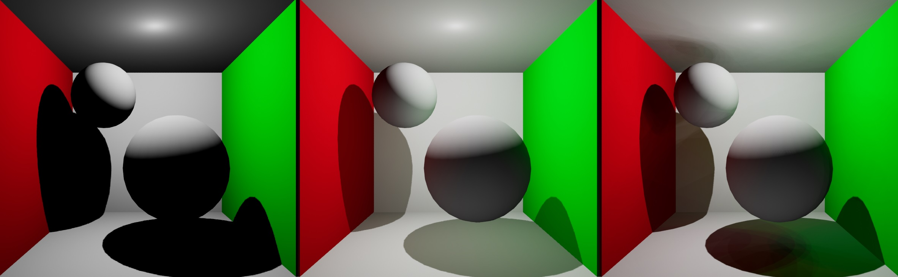

# uplt

## Description

Simple implementation of the Instant Radiosity global illumination method [1] in Unreal 5. I thought it would be a good learning project because it is simple to integrate with Unreal. Essentially, I spawn point lights at light paths to approximate light bounce. The technique offers a nice visual payoff for how easy it is to get running. I believe Instant Radiosity techniques were popular for production rendering after Keller introduced the concept in 1997 [1]. Similar techniques were the subject of interest in the real-time rendering research community in the 2000s. Crytek introduced the Instant Radiosty-inspired Light Propagation Volumes in 2009 [2], right before global illumination became widespread in games with probe-based methods and later more advanced techniques like cone tracing and denoised path tracing.

## Sample Render

## Features

* 1-bounce indirect illumination
* dynamic scenes
* point lights
* Lambertian materials

## Implementation

The concept is simple: place point lights on illuminated surfaces. The default Unreal shader samples these virtual point lights (VPLs) just like direct lights, so we automatically end up with nice bounce lighting, including occlusion effects like AO. The area directly illuminated by a light source can be represented by a complicated integral approximated with monte carlo point sampling. We place VPLs at random points hit by direct light and divide their strength by the number of VPLs placed. For real Monte Carlo integration we also have to weigh sample contributions based on the PDF of the light direction, though I only handle simple point lights with uniform PDF here. I do tweak VPL strength based on the BRDF of the material its placed on. For this project, I only support Lambertian materials, so I simply multiply VPL strength by the Lambertian cosine term during VPL creation. For BRDFs that depend on incoming and outgoing directions, you can store the light direction for each VPL and evaluate the BRDF when sampling the VPLs. Naturally, the quality of the render increases with the number of VPLs, though unlike Monte Carlo ray tracing, low sample counts don't necessarily produce noisy images. In my test scene, with only diffuse materials, single digit numbers of VPLs can produce nice-looking results. The main issue is the hard shadow map edges. Simple filters can probably smooth shadow edges, but I didn't try that here.

A scene rendered with 6, 18, and 72 VPLs.

One of the problems with instant radiostiy are distracting bright spots near corners. It's caused by the distance attenuation term in the shader. The physically-based inverse square attenuation isn't well-behaved. Obviously, there is a potential division by zero, so brightness approaches infinity as distance decreases [3]. Unreal offers an alternative, non physically-based attenuation formula that doesn't produce the artifact.

The left scene uses inverse square attenuation and the right scene uses exponential attenuation. Each method uses different light strength units, which causes the difference in brightness.

How we choose directions to place VPLs makes a significant difference with low sample counts. The simplest strategy is probably random sampling, but with few VPLs, it tends to miss important directions. Furthermore, when we update VPL positions every frame, the difference in VPL positions creates significant temporal noise. I found that Uniform sampling tends to look better. Surprisingly, Unreal 5's built-in Temporal Super Resolution can effectively filter a small amount of temporal noise. Slightly jittering uniform sampling directions similar to stratified sampling produces a small amount of flickering that TSR can smooth. Obviously, TSR wasn't built for this purpose and it would be better to use a more appropriate filter, though I was shocked it helps at all.

A scene rendered with 36 VPLs. The left image places VPLs according uniform sampling. The right image places VPLs according jittered sampling with Temporal Super Resolution enabled.

A large part of the rendering cost is shadow mapping. The Unreal profiler reported that for the frames I analysed, the ShadowProjection routine accounted for 66% of the Lights routine. This observation raises the question of whether we can skip shadow casting entirely. Subjectively, I think bounce lighting without occlusion still looks nice, though it misses some important effects like ambient occlusion, and some scenes will suffer more than others from light leaking through walls. In my test scene, it's not too objectionable. I think non-occluded GI looks good enough to be a worthwhile technique, since it can be so much cheaper. There were some papers in the 2000s that described systems with non-occluded GI [4], [5].

A scene rendered with no VPLs, VPLs without shadows, and VPLs with shadows. Notice that ambient occlusion only appears in the image with shadows.

Something that I didn't try out for this project were different light culling methods. Appropriate light culling should make a large difference for Instant Radiosity, but Unreal doesn't provide an option to change light culling technique. It seems like the VPL research community has developed unique light culling methods that I don't believe have been used in game engines. Dachsbacher et al. give a good overview [3]. VPL acceleration methods use importance sampling in several different ways for VPL generation and sampling. For example, Lightcuts approximate many adjacent lights with single light while leaving the most important VPLs intact [3]. This is different than tile and clustered rendering, which cluster pixels, not lights, and don't consider light importance. In the further research section of the classic clustered rendering paper [6], the authors propose a technique implemented in Multi-Dimensional Lightcuts, which can perform one lighting calculation for a light and a cluster of pixels cluster, amortizing the lighting cost across the pixels in the receiving cluster. Actually, I suppose light culling like tiled or clustered is a kind of importance sampling, as it avoids sampling lights with 0 contribution based on distance or facing direction. Naturally extending the idea, we might imagine a technique where we avoid sampling lights with low contributions based on strength, distance, brdf, visibility. I'm curious how well these methods could work with traditional rasterization.

## Limitations

* I suspect that it's faster to generate VPL positions by sampling a frame buffer generated from the light source, essentially rasterizing VPL positions rather than ray casting, though VPL generation was such a low portion of overall time that the performance gain wouldn't be that exciting.
* I don't support multiple bounces in this project. It would better distribute VPLs throughout the scene.
* We can use VPL methods to compute many difficult effects. For instance, we can approximate area lights by spawning multiple VPLs distributed over the light source, and we can implement IBR lighting by spawning VPLs over the HRDI map.

## Final thoughts

Instant Radiosity is intuitive and easy to develop. Naturally, as this was a simple learning project, there is almost certainly be no benefit over professional real-time GI techniques like Unreal 5's Lumen. However, I want to touch on the different kinds of artifacts produced by each method. Software Lumen features a lot of noise and temporal ghosting. According to the Unreal documentation, software Lumen uses a combination of scree-space ray tracing and ray tracing against a Signed Distance Field representation of the scene. I believe this means Lumen is essentially a descendent of the classic Voxel Cone Tracing method [7]. Software Lumen exhibits what I suspect is a kind of aliasing due to the low resolution of the SDF or possibly the surface cache, which uses aggressive temporal accumulation. Ghosting and other inconsistencies appear often in Unreal 5, due to accumulation and other such strategies used in features like Lumen and Temporal Super Resolution. As such techniques and others, like temporally denoised path tracing, become more common, I suspect ghosting and other temporal inconsistencies will be a defining feature of this generation's aesthetic. For that reason, methods that don't produce such artifacts, like Instant Radiostiy, might offer novel clarity.

The cost of VPL shadows also raises question of whether shadow mapping is the best visibility technique in this situation. Intuitively, the answer is no. As the number of cameras increases, the performance benefit of rasterization decreases compared to ray tracing. I believe that because of per-view vertex transformations, the complexity of rasterization includes a term linearly dependent on the number of views. In other words, the cost of rasterization grows with the number of cameras faster than the cost of ray tracing does, ignoring memory coherence issues. Similarly, I believe the performance benefit of rasterization compared to ray tracing decreases as camera resolution decreases. At least, I believe this is all true. I tried to find a scholarly paper about the complexity of rendering algorithms to verify my claims, but I couldn't really find what I wanted. In this particular use case, we have many views that we likely want to render in low resolution, so ray tracing obviously seems like the better choice. I believe it's for these reasons that Nvidia researches chose to ray trace VPL-like probes in a 2019 GI system, saying that the role of ray tracing in a hybrid renderer is to calculate "incoherent visibility queries." [8].

## References
1. A. Keller, "Instant Radiosity," in SIGGRAPH '97, August 1997, pp. 49-56, doi:10.1145/258734.258769
2. A. Kaplanyan, and C. Dachsbacher, "Cascaded Light Propagation Volumes for Real-Time Indirect Illumination," in I3D'10, February 2010, pp. 99–107. doi:10.1145/1730804.1730821
3. C. Dachsbacher, J. Křivánek, M. Hašan, A. Arbree, B. Walter, and J. Novák, "Scalable Realistic Rendering with Many-Light Methods," Computer Graphics Forum, volume 33, issue 1, pp. 88-104
4. C. Dachsbacher, and M. Stamminger, "Reflective shadow maps," in I3D'05, April 2005, pp. 203–208, doi:10.1145/1053427.1053460
5. C. Dachsbacher, M. Stamminger, "Splatting indirect illumination," in I3D'06, March 2006, pp. 93–100, doi:10.1145/1111411.1111428
6. O. Olsson, M. Billeter, and U. Assarsson, "Clustered deferred and forward shading," In EGGH-HPG'12, June 2012, pp. 87–96.
7. C. Crassin, F. Neyret, M. Sainz, S. Green, and E. Eisemann, "Interactive indirect illumination using voxel-based cone tracing: an insight," in SIGGRAPH '11, August 2011, article number 20, doi:10.1145/2037826.2037853
8. Z. Majercik, J. Guertin, D. Nowrouzezahrai, and M. McGuire, "Dynamic Diffuse Global Illumination with Ray-Traced Irradiance Fields," Journal of Computer Graphics Techniques (JCGT), vol. 8, no. 2, pp. 1-30, June 2019
